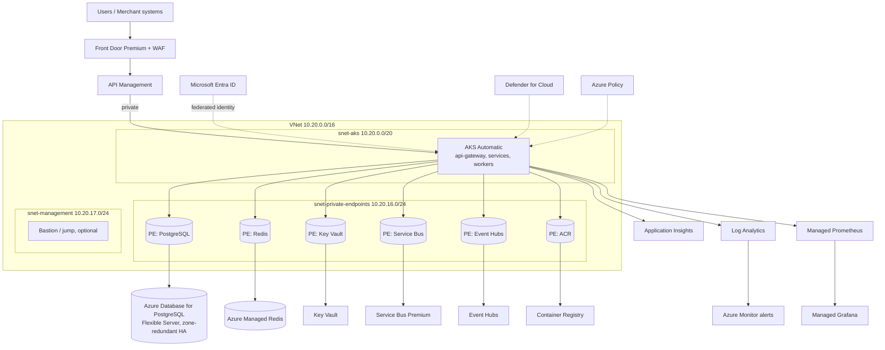
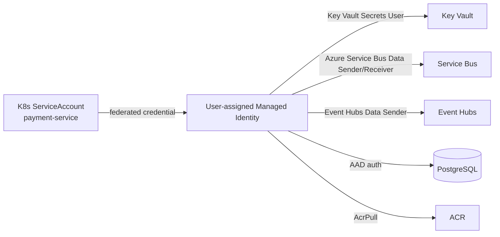
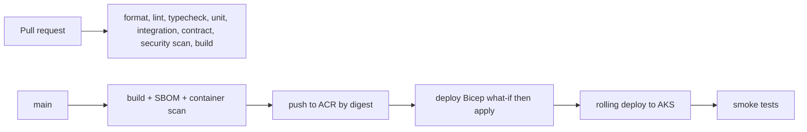

# Azure Topology

> Status: Bicep is in `infra/azure` and compiles with `bicep build`. It has not been deployed.
> Workload identities and the permission matrix are in place. Kubernetes manifests are in
> `infra/kubernetes` and have not been applied to a cluster.

## 1. Principles

- Managed services in Azure; the same application code runs locally against Docker Compose.
- Private connectivity by default: PostgreSQL, Redis, Key Vault, Service Bus and Event Hubs are
  reached over Private Endpoints, not public IPs.
- Workload Identity (federated credentials) instead of static client secrets.
- Least privilege on every role assignment, justified in a permission matrix.
- Nothing environment-specific is hardcoded in Bicep; subscription, tenant and secrets come from
  parameters, Key Vault references or CI OIDC context.

## 2. Topology

## 3. Service inventory

| Azure service | SKU intent | Used for | Notes |
| --- | --- | --- | --- |
| AKS Automatic | — | All application workloads | Node autoprovisioning; HPA + KEDA |
| Azure Container Registry | Premium | Images | Private endpoint, immutable digests |
| Azure Database for PostgreSQL Flexible Server | General Purpose, zone-redundant HA | 7 logical databases | Synchronous standby; PITR |
| Azure Managed Redis | — | Caching, rate limiting | Never the source of financial truth |
| Service Bus | Premium | Workflow commands, queues, DLQ | Peek-lock; duplicate detection is a *window*, not a guarantee |
| Event Hubs | Standard/Premium | High-volume event streams | Kafka-compatible surface keeps local Kafka viable |
| Key Vault | Standard, RBAC mode | Secrets, certificates | CSI driver + Workload Identity |
| Front Door Premium + WAF | — | Edge, TLS, OWASP rules | |
| API Management | — | Auth, rate limits, request size, product policies | |
| Application Insights + Log Analytics | — | Traces, logs | OTel exporter |
| Managed Prometheus + Grafana | — | Metrics, dashboards | |
| Defender for Cloud, Azure Policy | — | Posture, guardrails | |

## 4. Environments

| Environment | Purpose | Differences |
| --- | --- | --- |
| `dev` | Engineering | Smaller SKUs, no zone redundancy, shorter retention |
| `demo` | Portfolio demonstration | Production shape, reduced scale, acquirer simulator enabled |
| `prod` | Reference production | HA, zone redundancy, full retention, simulator disabled by policy |

Separate `.bicepparam` files per environment; no environment values inside modules.

## 5. Messaging split

| Channel | Azure | Local | Rationale |
| --- | --- | --- | --- |
| Workflow commands (authorize, capture, refund, settlement, reconciliation jobs) | Service Bus queues | Kafka topics | Needs per-message lock, retry, DLQ semantics |
| Domain event streams (payment, ledger, audit, risk analytics) | Event Hubs | Kafka topics | High volume, partitioned, replayable |

The application talks to `packages/messaging` interfaces only, so neither the domain nor the
application layer contains Service Bus or Kafka types. See ADR-008.

## 6. Identity and secrets

One managed identity per service, scoped to exactly the queues/topics/secrets that service uses.
No Owner or Contributor assignments for workloads. The permission matrix
(`service → resource → role → reason`) is produced in Phase 12.

## 7. Resilience assumptions (to be validated in Phase 17)

| Concern | Assumption |
| --- | --- |
| PostgreSQL HA | Zone-redundant HA with warm standby and synchronous replication; failover is seconds-to-minutes and drops in-flight connections — the application must reconnect and retry idempotently |
| Backups | Automated backups with point-in-time restore inside the retention window |
| Region outage | Single-region deployment initially; cross-region DR is documented as a gap, not claimed |
| Message retention | Service Bus/Event Hubs retention bounds how far outbox replay can help; outbox rows are the real recovery source |
| RPO / RTO | Stated explicitly in `docs/disaster-recovery/strategy.md` with the reasoning, not aspirational numbers |

## 8. CI/CD

GitHub Actions authenticates to Azure with OIDC federation; no long-lived Azure credentials are
stored in GitHub. Deployments reference image digests, not mutable tags.
