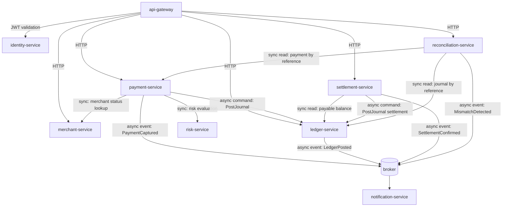

# Bounded Contexts and Data Ownership

> Status: Phase 0. Defines ownership rules that later phases must not violate.

## 1. Rule

Each bounded context owns exactly one PostgreSQL logical database. **No service reads or writes
another service's schema.** Cross-context data movement happens only through APIs (synchronous,
when a caller needs an answer now) or events/commands (asynchronous, when durability matters).

There are **no cross-service SQL joins** and **no distributed database transactions**.

## 2. Contexts

```mermaid
graph LR
    subgraph identity["Identity Context"]
        I1[users] --- I2[roles] --- I3[permissions] --- I4[refresh_tokens] --- I5[token_revocations]
    end
    subgraph merchant["Merchant Context"]
        M1[merchants] --- M2[merchant_settlement_config] --- M3[merchant_accounts_ref] --- M4[merchant_risk_metadata]
    end
    subgraph payment["Payment Context"]
        P1[payments] --- P2[payment_attempts] --- P3[idempotency_keys] --- P4[outbox_events] --- P5[inbox_events]
    end
    subgraph ledger["Ledger Context"]
        L1[accounts] --- L2[journals] --- L3[ledger_entries] --- L4[account_balances]
    end
    subgraph settlement["Settlement Context"]
        S1[settlement_batches] --- S2[settlement_items] --- S3[settlement_snapshots] --- S4[settlement_adjustments]
    end
    subgraph recon["Reconciliation Context"]
        R1[statement_imports] --- R2[external_transactions] --- R3[reconciliation_runs] --- R4[reconciliation_results] --- R5[reconciliation_cases] --- R6[case_actions]
    end
    subgraph risk["Risk Context"]
        K1[risk_rules] --- K2[risk_evaluations] --- K3[velocity_counters]
    end
    subgraph notification["Notification Context"]
        N1[notification_requests] --- N2[delivery_attempts]
    end
```

## 3. Ownership table

| Context | Logical DB | Owns | Explicitly does NOT own |
| --- | --- | --- | --- |
| Identity | `ledgerflow_identity` | Users, roles, permissions, tokens, revocations | Merchants, payments, balances |
| Merchant | `ledgerflow_merchant` | Merchant profile, status, settlement config, risk metadata, references to ledger account IDs | Accounting balances, payment lifecycle |
| Payment | `ledgerflow_payment` | Payment lifecycle, attempts, provider references, idempotency records | Accounting balances, settlement math |
| Ledger | `ledgerflow_ledger` | Chart of accounts, accounts, journals, entries, materialized balances | Payment status, merchant profile |
| Settlement | `ledgerflow_settlement` | Batches, items, snapshots, fees, payout instructions | Ledger truth (it requests postings) |
| Reconciliation | `ledgerflow_reconciliation` | Statement imports, external transactions, match results, cases, case actions | Payment/ledger mutation rights |
| Risk | `ledgerflow_risk` | Rules, evaluations, velocity counters | Payment decisions execution |
| Notification | `ledgerflow_notification` | Notification requests, delivery attempts | Any financial state |

Locally all logical databases run on a single PostgreSQL container with **separate databases and
separate application roles**, so ownership is enforced by grants rather than by convention.

## 4. Context relationships

### Integration style per relationship

| From | To | Style | Why |
| --- | --- | --- | --- |
| payment → risk | Sync HTTP | Caller needs the decision before responding to the merchant |
| payment → merchant | Sync HTTP (cached) | Merchant status gate; cache with short TTL in Redis |
| payment → ledger | Async command via outbox | Ledger posting must survive a payment-service crash |
| settlement → ledger | Sync read + async command | Reads are queries; postings must be durable |
| reconciliation → payment/ledger | Sync read-only | Investigation queries, never mutation |
| any → notification | Async event | Notification failure must never affect financial state |

## 5. Shared packages (code sharing, not data sharing)

`packages/*` are **libraries**, not a shared database. They contain no business state.

| Package | Purpose |
| --- | --- |
| `money` | Integer minor-unit money type and currency rules |
| `database` | Pool, transaction helper, migration runner, error mapping |
| `errors` | Typed application errors and the API error envelope |
| `contracts` | API request/response Zod schemas |
| `events` | Versioned event envelope and event payload schemas |
| `messaging` | Broker-agnostic publisher/consumer/command-bus abstraction |
| `idempotency` | Idempotency-key store and request-hash rules |
| `auth` | JWT validation, permission checks, service tokens |
| `audit` | Append-only audit writer and redaction |
| `observability` | OTel bootstrap, metrics registry |
| `logger` | Pino configuration with redaction |
| `config` | Zod-validated environment configuration |
| `test-utils` | Testcontainers helpers, fixtures |

## 6. Ownership violations to watch for in review

- A service importing another service's repository or migration.
- A query joining tables from two logical databases.
- A service writing to `ledger_entries` other than `ledger-service`.
- A "shared" package that holds mutable business state.
- Reconciliation mutating payments or ledger entries directly instead of opening a case.
