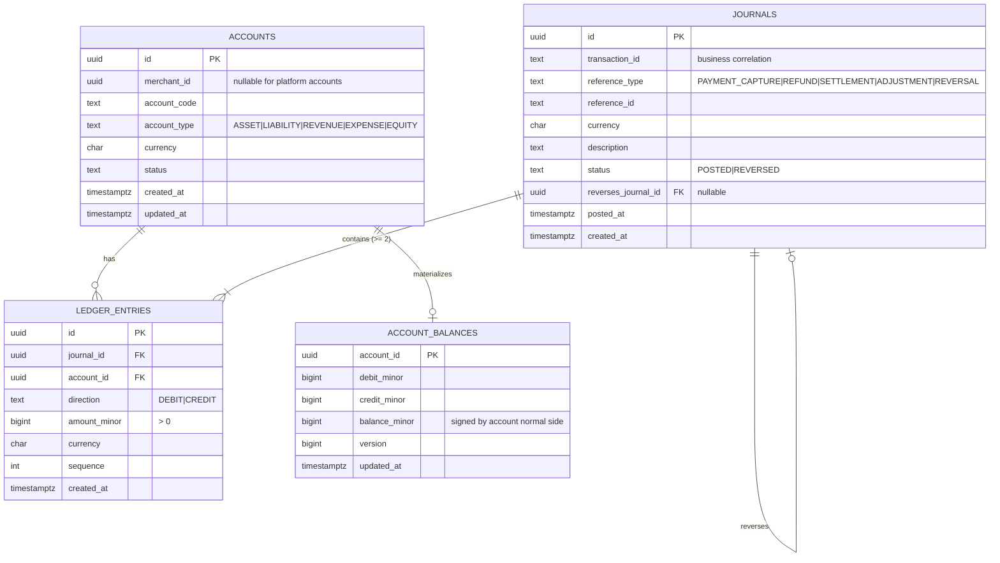
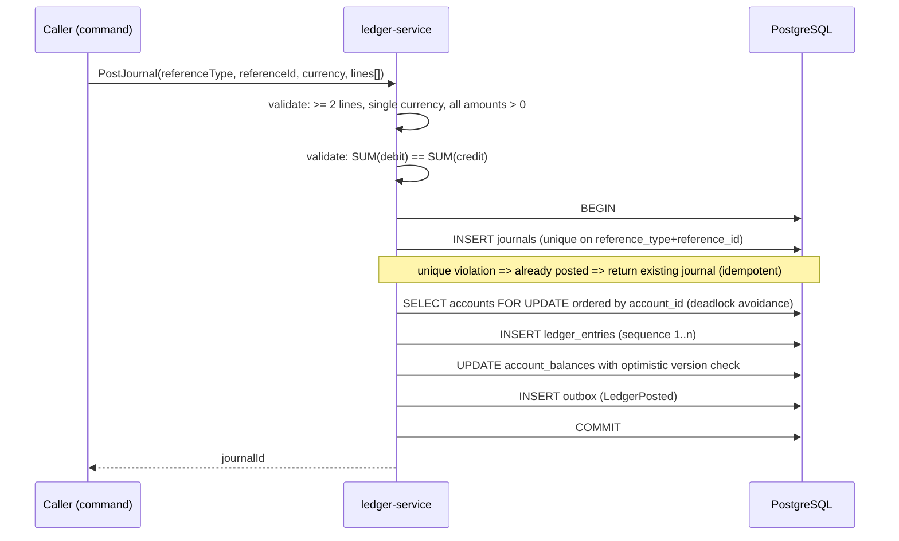
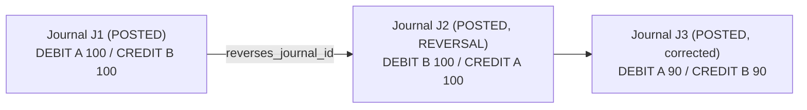

# Ledger Architecture

> Status: Implemented in `apps/ledger-service`. Invariants L1–L12 are enforced in
> `src/domain/posting.ts`, the migration triggers, and `ledger.integration.test.ts`.
> The `LedgerPosted` outbox row joins the posting transaction in Phase 7; posting itself
> does not publish.

## 1. Position in the platform

The ledger is the authoritative record of financial movement. Payment status is workflow state;
the ledger is accounting truth. If the two ever disagree, the ledger wins and a reconciliation
case is opened.

## 2. Data model

### Account types and normal sides

| Type | Normal side | Increases with | Example accounts |
| --- | --- | --- | --- |
| ASSET | DEBIT | debit | `SETTLEMENT_CASH`, `MERCHANT_RECEIVABLE` |
| LIABILITY | CREDIT | credit | `MERCHANT_PAYABLE` |
| REVENUE | CREDIT | credit | `PROCESSING_FEE_REVENUE` |
| EXPENSE | DEBIT | debit | `PAYMENT_NETWORK_COST` |
| EQUITY | CREDIT | credit | `PLATFORM_EQUITY` |

`balance_minor` is stored as a signed value using the account's normal side, so a liability with
`credit_minor > debit_minor` has a positive balance.

## 3. Chart of accounts (initial)

| Code | Type | Scope | Purpose |
| --- | --- | --- | --- |
| `MERCHANT_RECEIVABLE` | ASSET | per merchant | Amount owed by the acquirer for captured payments |
| `MERCHANT_PAYABLE` | LIABILITY | per merchant | Amount the platform owes the merchant |
| `SETTLEMENT_CASH` | ASSET | platform | Cash held/paid for settlement |
| `PROCESSING_FEE_REVENUE` | REVENUE | platform | Fees earned |
| `REFUND_CLEARING` | LIABILITY | platform | Refunds in flight |
| `CHARGEBACK_LIABILITY` | LIABILITY | platform | Chargeback exposure |
| `SUSPENSE` | ASSET | platform | Unidentified/unmatched movement pending reconciliation |

`SUSPENSE` exists precisely so that unexplained external movement is recorded rather than
silently dropped; every suspense balance must be traceable to a reconciliation case.

## 4. Posting examples

### Capture ₹1,000.00 (100000 paise)

| Account | Direction | Amount (minor) |
| --- | --- | --- |
| `MERCHANT_RECEIVABLE` (merchant) | DEBIT | 100000 |
| `MERCHANT_PAYABLE` (merchant) | CREDIT | 100000 |

### Settlement of ₹1,000.00 with ₹10.00 fee

| Account | Direction | Amount (minor) |
| --- | --- | --- |
| `MERCHANT_PAYABLE` | DEBIT | 100000 |
| `SETTLEMENT_CASH` | CREDIT | 99000 |
| `PROCESSING_FEE_REVENUE` | CREDIT | 1000 |

Debits 100000 == credits 100000.

### Refund ₹200.00 of a captured payment

| Account | Direction | Amount (minor) |
| --- | --- | --- |
| `MERCHANT_PAYABLE` | DEBIT | 20000 |
| `MERCHANT_RECEIVABLE` | CREDIT | 20000 |

## 5. Posting algorithm

Accounts are locked in a deterministic order (sorted by account ID) so concurrent journals
touching the same account set cannot deadlock.

## 6. Immutability

- `ledger_entries` has no `updated_at`. There is no update path in the repository layer.
- Database triggers raise an exception on `UPDATE` or `DELETE` of `ledger_entries`, and on
  `UPDATE` of a `POSTED` journal except for the single allowed `status -> REVERSED` transition.
- The application role owning the ledger database has `INSERT, SELECT` on `ledger_entries` and no
  `UPDATE`/`DELETE` grant. Defence in depth: application, trigger, and grant.

### Correction via reversal

A journal can be reversed at most once (`UNIQUE (reverses_journal_id)`), and a reversal cannot
itself be reversed — a second correction is a new reversal of the corrected journal.

## 7. Invariants (each becomes a test in Phase 5)

| # | Invariant | Enforcement |
| --- | --- | --- |
| L1 | Every posted journal balances | Application validation + `CHECK`-backed verification query + test |
| L2 | Every entry belongs to exactly one journal | FK `NOT NULL` |
| L3 | Every posted journal has ≥ 2 entries | Application validation + verification query |
| L4 | A journal cannot mix currencies | Entry currency `=` journal currency (FK-enforced composite) |
| L5 | Entry amounts are positive integers | `CHECK (amount_minor > 0)` |
| L6 | Posted entries cannot be updated | Trigger + grant |
| L7 | Posted entries cannot be deleted | Trigger + grant |
| L8 | A reference posts at most one journal | `UNIQUE (reference_type, reference_id)` |
| L9 | A journal is reversed at most once | `UNIQUE (reverses_journal_id)` |
| L10 | Reversal references the original | `reverses_journal_id NOT NULL` for reversal type |
| L11 | Materialized balance equals entry aggregate | Periodic verification job + test |
| L12 | Sum of all debits equals sum of all credits platform-wide | Verification query + test |

## 8. Balances

Two reads are supported:

1. **Authoritative** — aggregate over `ledger_entries` (slower, always correct).
2. **Materialized** — `account_balances`, updated in the same transaction as the entries.

They must always agree; a scheduled verifier compares them and emits
`ledger_balance_drift_total` plus an alert if they diverge. Materialization is in-transaction, not
eventual, so drift indicates a bug and is treated as a severity-1 signal.

## 9. Concurrency

| Scenario | Protection |
| --- | --- |
| Two journals hitting the same account | `SELECT ... FOR UPDATE` on accounts in sorted order |
| Duplicate command delivery | `UNIQUE (reference_type, reference_id)` — second post returns the first journal |
| Balance update race | Optimistic `version` check inside the row lock (belt and braces) |
| Concurrent reversal | `UNIQUE (reverses_journal_id)` |

## 10. Indexes

| Index | Rationale |
| --- | --- |
| `ledger_entries (account_id, created_at DESC)` | Account statement queries |
| `ledger_entries (journal_id, sequence)` | Journal rendering |
| `journals (reference_type, reference_id)` UNIQUE | Idempotent posting |
| `journals (transaction_id)` | Cross-service tracing of a business transaction |
| `journals (posted_at DESC)` | Operational listing |
| `accounts (merchant_id, account_code, currency)` UNIQUE | Account resolution |
