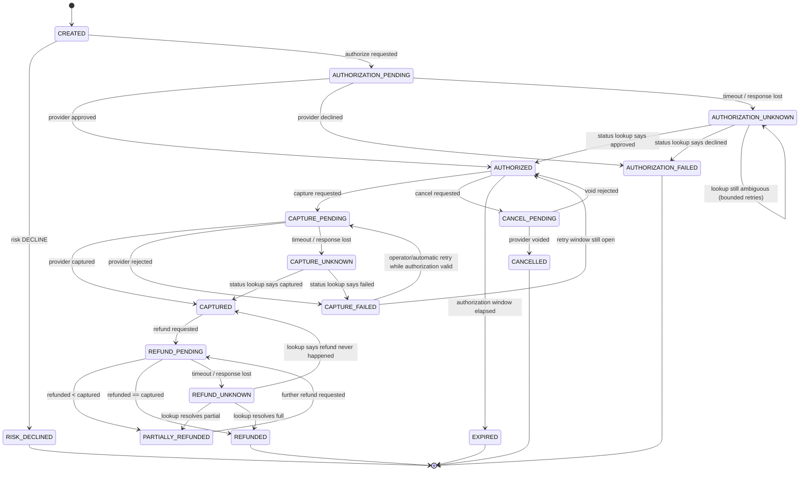
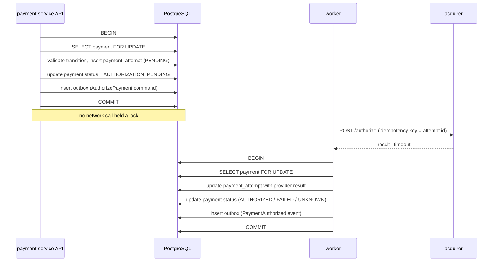

# Payment Lifecycle

> Status: Implemented in `apps/payment-service` and `apps/acquirer-simulator`.
> Provider calls run between committed transactions. Ledger posting is requested after
> capture/refund commits; if that call fails the posting stays `PENDING` and
> `POST /payments/{id}/ledger-postings` retries it. Durable publication via the outbox
> is Phase 7. Risk decline is a legal transition and is enforced in Phase 10.

## 1. States

| State | Terminal | Meaning |
| --- | --- | --- |
| `CREATED` | no | Payment record exists, no provider interaction yet |
| `RISK_DECLINED` | yes | Risk engine declined before any provider call |
| `AUTHORIZATION_PENDING` | no | Authorization command persisted, provider call in flight or queued |
| `AUTHORIZATION_UNKNOWN` | no | Provider outcome is ambiguous; **requires resolution**, never retried blindly |
| `AUTHORIZED` | no | Funds reserved at provider |
| `AUTHORIZATION_FAILED` | yes | Provider declined permanently |
| `CAPTURE_PENDING` | no | Capture command persisted |
| `CAPTURE_UNKNOWN` | no | Capture outcome ambiguous |
| `CAPTURED` | no | Captured in full; ledger posted |
| `CAPTURE_FAILED` | no | Capture attempt failed; payment stays `AUTHORIZED` if authorization still valid |
| `REFUND_PENDING` | no | Refund command persisted |
| `REFUND_UNKNOWN` | no | Refund outcome ambiguous |
| `PARTIALLY_REFUNDED` | no | Refunded amount < captured amount |
| `REFUNDED` | yes | Refunded amount == captured amount |
| `CANCEL_PENDING` | no | Cancellation of an authorization requested |
| `CANCELLED` | yes | Authorization voided before capture |
| `EXPIRED` | yes | Authorization expired without capture |

## 2. State machine



Transitions not present in this diagram are invalid and must raise a typed domain error
(`INVALID_PAYMENT_STATE_TRANSITION`). Status is never set by a generic `PATCH`.

## 3. Amount invariants

Let `authorizedMinor`, `capturedMinor`, `refundedMinor` be non-negative integers on the payment.

- `capturedMinor <= authorizedMinor`
- `refundedMinor <= capturedMinor`
- Capture is allowed only from `AUTHORIZED` (or `CAPTURE_FAILED` inside the authorization window).
- Partial capture is allowed once; the residual authorization is released (documented in ADR-004).
- Refund of `0` is invalid; refund currency must equal payment currency.

## 4. Transaction boundaries

The rule from the specification, stated concretely:

**Never call the provider inside a database transaction.**



Ledger posting for a capture follows the same shape: the ledger journal is written inside
`ledger-service`'s own transaction, triggered by a command, and the resulting `LedgerPosted` event
is what advances the payment's ledger-posted marker.

## 5. Idempotency

Every state-changing endpoint requires an `Idempotency-Key` header.

| Situation | Behaviour |
| --- | --- |
| New key | Reserve key in the same transaction as the business effect, return result |
| Same key, same request hash, completed | Return the stored original response, HTTP status included |
| Same key, same request hash, in flight | `409 IDEMPOTENT_REQUEST_IN_PROGRESS` (client retries) |
| Same key, different request hash | `409 IDEMPOTENCY_KEY_CONFLICT` |
| Key expired | Treated as new key; expiry must exceed the provider's retry window |

Uniqueness is enforced by a PostgreSQL unique constraint on `(actor_scope, idempotency_key)`.
Redis may cache results, but correctness never depends on Redis.

## 6. Payment attempts

Every provider interaction creates a `payment_attempts` row. Retries append new attempts; they
never overwrite history. The attempt ID is the idempotency key sent to the provider, which is what
makes a provider-side duplicate safe.

## 7. The unknown-state scenario

```mermaid
sequenceDiagram
    participant W as worker
    participant ACQ as acquirer
    participant DB as PostgreSQL
    participant REC as status-reconciler

    W->>ACQ: authorize(attempt_id=A1)
    ACQ->>ACQ: authorization SUCCEEDS
    ACQ--xW: response lost (network failure)
    W->>DB: attempt A1 = UNKNOWN, payment = AUTHORIZATION_UNKNOWN
    Note over W: no blind retry — a retry could double-charge
    REC->>ACQ: GET /status?attempt_id=A1
    ACQ-->>REC: AUTHORIZED, provider_ref=PR-1
    REC->>DB: BEGIN; attempt A1 = SUCCEEDED; payment = AUTHORIZED; outbox PaymentAuthorized; COMMIT
```

Ledger effects happen exactly once because the ledger posting is keyed by
`(referenceType, referenceId)` with a unique constraint, so a replayed command cannot double-post.

## 8. Events emitted

| Event | When |
| --- | --- |
| `PaymentCreated` | Payment row committed |
| `PaymentAuthorizationRequested` | Authorization command enqueued |
| `PaymentAuthorized` | Authorization succeeded |
| `PaymentAuthorizationFailed` | Authorization permanently failed |
| `PaymentAuthorizationUnknown` | Outcome ambiguous — drives alerting |
| `PaymentCaptured` | Capture succeeded |
| `PaymentRefunded` / `PaymentPartiallyRefunded` | Refund succeeded |
| `PaymentCancelled` | Authorization voided |

Events are facts in the past tense; commands (`AuthorizePayment`, `CapturePayment`) are separate.
