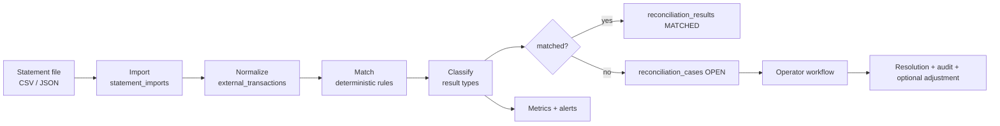
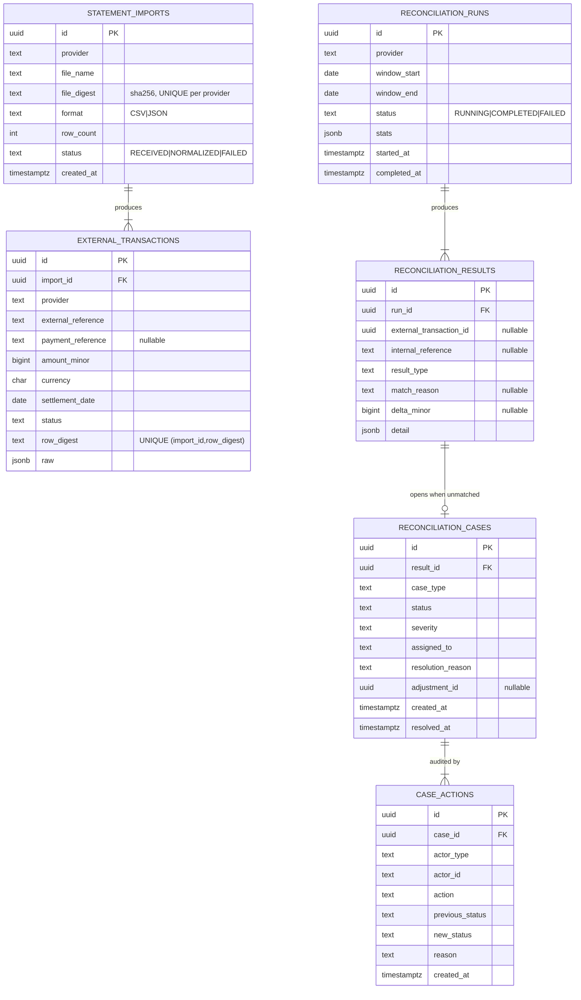
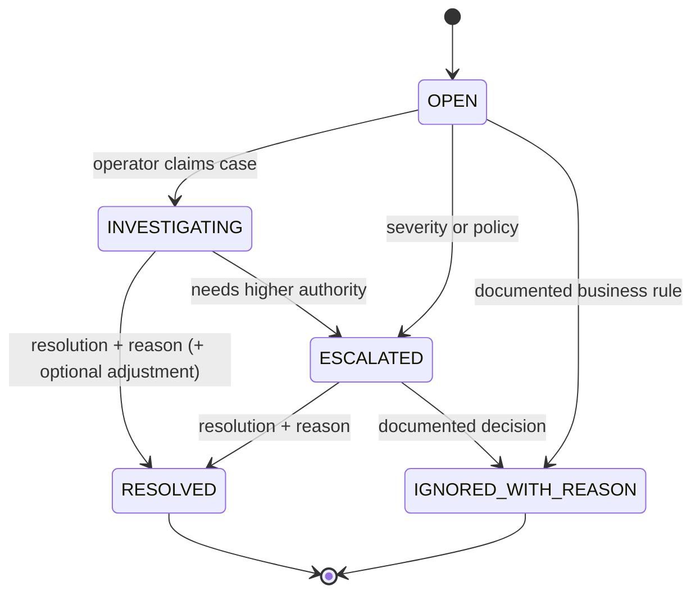
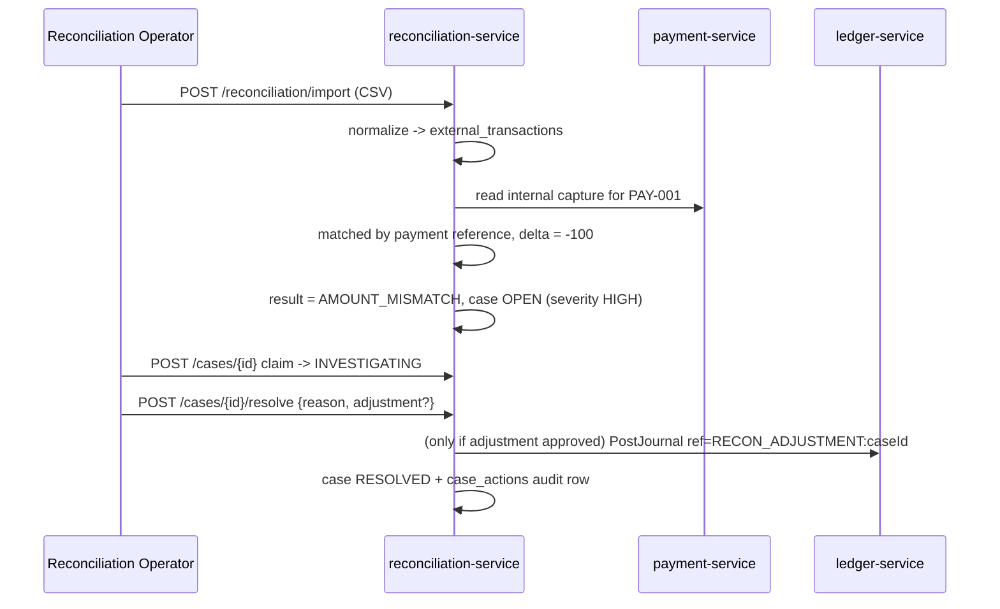

# Reconciliation Architecture

> Status: Implemented in `apps/reconciliation-service`. Matching is deterministic. Non-matches
> open cases. Resolution writes an audit row and does not change payment or ledger rows.

## 1. Purpose

Reconciliation answers the question a payments company is asked every single day: *does what the
acquirer says match what our ledger says?* It imports external statements, normalizes them,
matches them against internal records, classifies every discrepancy, and opens an auditable case
for anything that does not match.

**Reconciliation never silently modifies financial records.** It can open cases, propose
adjustments, and — only through an explicit approved workflow — trigger an adjustment posting that
is traceable back to a case.

## 2. Pipeline

## 3. Data model

## 4. Matching hierarchy

Rules are applied in order; the first match wins and the reason is recorded.

| Order | Rule | Reason code |
| --- | --- | --- |
| 1 | External `provider_reference` == internal `provider_reference` | `MATCHED_BY_PROVIDER_REFERENCE` |
| 2 | External `payment_reference` == internal payment ID/reference | `MATCHED_BY_PAYMENT_REFERENCE` |
| 3 | `amount_minor` + `currency` + `settlement_date` unique on both sides | `MATCHED_BY_AMOUNT_DATE` |
| 4 | Amount + currency + date within a configured tolerance window (disabled by default) | `MATCHED_BY_TOLERANCE` |

Rule 3 applies only when the triple is unique on **both** sides; an ambiguous many-to-many group
produces `DUPLICATE_EXTERNAL` / `DUPLICATE_INTERNAL` rather than a guess. Rule 4 is off unless
explicitly configured, and its configuration is recorded in the run stats.

## 5. Result types

| Result | Meaning | Default case severity |
| --- | --- | --- |
| `MATCHED` | Reference, amount, currency and date all agree | none |
| `MISSING_INTERNAL` | External record with no internal counterpart | HIGH |
| `MISSING_EXTERNAL` | Internal captured payment absent from the statement | HIGH |
| `AMOUNT_MISMATCH` | Matched by reference, amounts differ | HIGH |
| `CURRENCY_MISMATCH` | Matched by reference, currencies differ | CRITICAL |
| `DUPLICATE_EXTERNAL` | Same external reference appears more than once | HIGH |
| `DUPLICATE_INTERNAL` | Same internal reference matched more than once | HIGH |
| `DATE_MISMATCH` | Matched, settlement date outside the expected window | MEDIUM |
| `STATUS_MISMATCH` | Matched, provider status conflicts with internal status | HIGH |

## 6. Case state machine

Every transition requires actor, timestamp, reason, previous state and new state, written to
`case_actions`. There is no endpoint that edits a case's status without a reason, and closing a
case never changes a payment or a ledger entry by itself.

## 7. The demo scenario

Internal `PAY-001` = 10000 minor units; external statement says 9900.

The system never "fixes" the 100-unit difference on its own.

## 8. Scheduling, restartability, idempotency

- Import is idempotent on `(provider, file_digest)`; re-uploading the same file is rejected as a
  duplicate import rather than creating duplicate external transactions.
- Each row is idempotent on `(import_id, row_digest)`.
- A run is idempotent on `(provider, window_start, window_end, run_key)`; a crashed run is resumed
  by reprocessing unresolved external transactions, and re-matching an already matched row is a
  no-op.
- Cases are idempotent on `(result_id)` so a rerun does not open duplicate cases for the same
  discrepancy.

## 9. Metrics and alerts

`reconciliation_runs_total`, `reconciliation_mismatches_total{type}`,
`reconciliation_cases_open_total{severity}`, `reconciliation_run_duration_seconds`.
Alert on a mismatch-rate spike, on any `CURRENCY_MISMATCH`, and on open critical cases exceeding
an age threshold.

## 10. Reconciliation as the recovery mechanism for unknown states

Reconciliation is not only a daily accounting job — it is the resolution path for
`AUTHORIZATION_UNKNOWN`, `CAPTURE_UNKNOWN`, `REFUND_UNKNOWN` and `SETTLEMENT_UNKNOWN`. A status
reconciler queries the provider for each ambiguous attempt and drives the state machine to a
definite outcome, which is why the platform can refuse to blindly retry without getting stuck.
