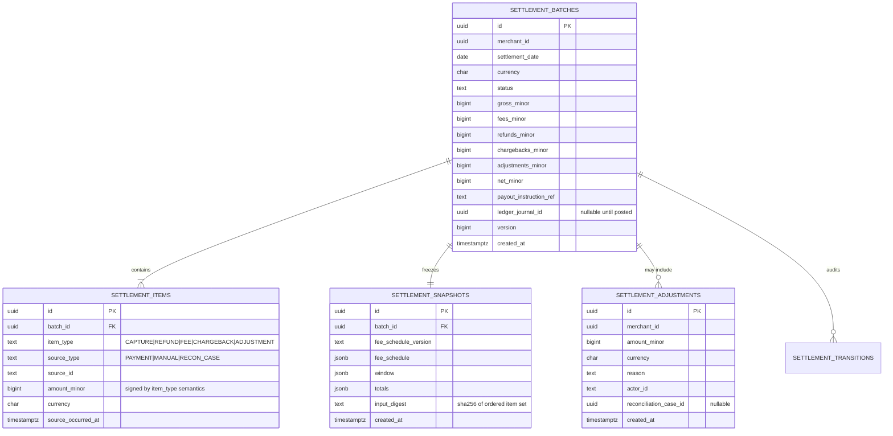
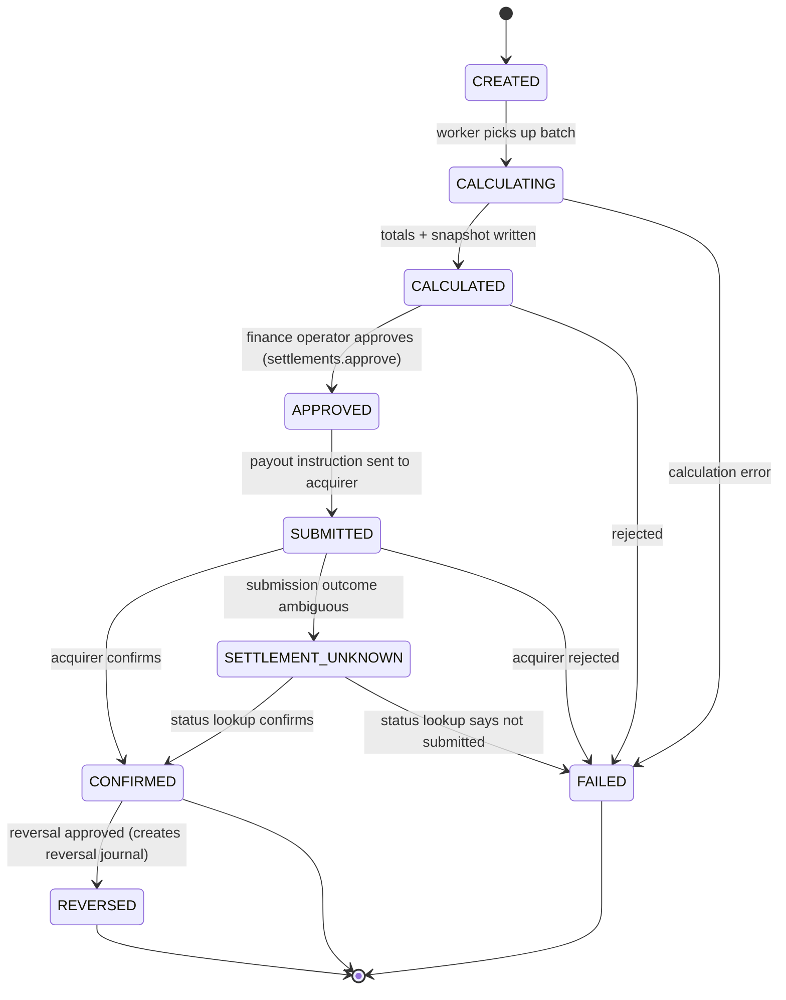

# Settlement Architecture

> Status: Implemented in `apps/settlement-service`. Totals are frozen on a snapshot whose digest
> is reproducible from the stored items. A second confirmation is rejected.

## 1. Purpose

Settlement turns a merchant's captured activity over a period into a single payable amount, a
reproducible calculation record, and a set of ledger postings.

The hard requirement: **a historical settlement must be reproducible from the settlement records
alone.** Recomputing it later from mutable payment rows is not acceptable, because payments keep
changing (refunds, chargebacks) after the settlement window closed.

## 2. Data model



## 3. Calculation

```
gross        = Σ captured amounts in window
refunds      = Σ refunds in window
chargebacks  = Σ chargebacks in window
fees         = feeSchedule.apply(gross, itemCount)
adjustments  = Σ approved adjustments in window (signed)
net          = gross − refunds − chargebacks − fees + adjustments
```

All values are integer minor units in a single currency. A batch never mixes currencies; a
merchant transacting in two currencies gets two batches.

### Fee rounding

Percentage fees use integer arithmetic with an explicit, documented rounding rule:

```
feeMinor = floor((grossMinor * bps) / 10000) + fixedMinor
```

Rounding is **half-up at the item level, then summed** — the rule is recorded in the snapshot's
`fee_schedule_version`, so a schedule change never retroactively alters an old settlement.

### Reproducibility

The snapshot stores the fee schedule used, the window boundaries, the totals, and an
`input_digest` (SHA-256 over the ordered `(item_type, source_id, amount_minor)` tuples). Replaying
the calculation from `settlement_items` must produce the same digest and the same totals. A test
asserts this.

## 4. State machine



Every transition writes a `settlement_transitions` row (actor, from, to, reason, correlation ID)
and emits an event. `CONFIRMED` is guarded by a unique constraint so a duplicate confirmation
message cannot confirm twice or post the journal twice.

## 5. Ledger interaction

```mermaid
sequenceDiagram
    participant SET as settlement-service
    participant LED as ledger-service
    participant DB as settlement DB

    SET->>LED: GET /accounts/{merchantPayable}/balance
    LED-->>SET: available payable balance
    SET->>SET: assert net_minor <= available payable
    SET->>DB: BEGIN; status=APPROVED; outbox(PostJournal, ref=SETTLEMENT:batchId); COMMIT
    LED->>LED: BEGIN; journal (DEBIT payable, CREDIT cash, CREDIT fee revenue); COMMIT
    LED-->>SET: LedgerPosted event (ref=SETTLEMENT:batchId)
    SET->>DB: record ledger_journal_id (idempotent on repeat delivery)
```

The `UNIQUE (reference_type, reference_id)` constraint in the ledger means a redelivered
`PostJournal` command returns the existing journal instead of double-posting.

## 6. Invariants

| # | Invariant |
| --- | --- |
| S1 | `net = gross − refunds − chargebacks − fees + adjustments` exactly, in integer minor units |
| S2 | A batch contains exactly one currency |
| S3 | Settlement net cannot exceed the merchant's available payable balance |
| S4 | A batch cannot be confirmed twice |
| S5 | A payment's capture appears in at most one batch (`UNIQUE (source_type, source_id, item_type)`) |
| S6 | Recalculating from items reproduces the stored totals and digest |
| S7 | Every state transition has an audit row with actor and reason |
| S8 | A reversed settlement references the reversing journal |

## 7. Scheduling and restartability

Batch creation is a scheduled job keyed by `(merchant_id, settlement_date, currency)` with a
unique constraint, so re-running the scheduler for the same day is a no-op rather than a duplicate
batch. Workers claim batches with `SELECT ... FOR UPDATE SKIP LOCKED`, which makes the worker pool
horizontally scalable and crash-tolerant.
