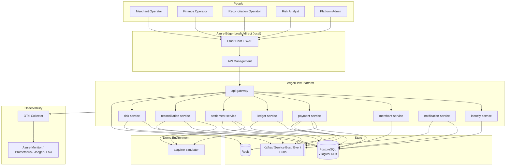
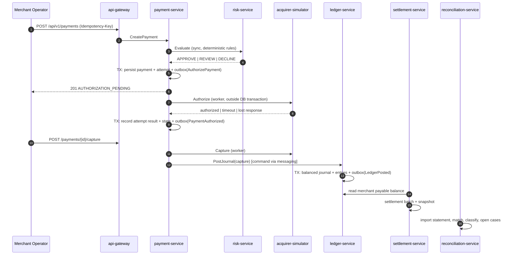

# LedgerFlow — System Context

> Status: Phase 0 (architecture only). No business code exists yet.

## 1. What LedgerFlow is

LedgerFlow is a distributed payments, double-entry ledger, settlement and reconciliation
platform for merchants. It is a **simulation of a payment platform**, not an integration with a
real acquirer. The acquirer is replaced by a deterministic simulator so that failure modes
(timeouts, lost responses, duplicate responses, wrong settlement amounts) can be reproduced on
demand.

The system of record for all financial state is **PostgreSQL**. Messaging is used for durable
workflow progression and integration, never as the source of financial truth.

## 2. Actors

| Actor | Description | Primary interactions |
| --- | --- | --- |
| Customer | End payer of a merchant | Initiates payment (via merchant), no direct platform login in scope |
| Merchant Admin | Owns a merchant account | Onboarding, settlement config, reads payments/settlements |
| Merchant Operator | Day-to-day merchant staff | Creates/captures/refunds payments |
| Finance Operator | Platform finance staff | Approves settlements, inspects ledger |
| Risk Analyst | Platform risk staff | Reviews risk decisions, overrides with reason |
| Reconciliation Operator | Platform ops staff | Imports statements, works reconciliation cases |
| Support | Platform support staff | Read-only investigation |
| Platform Admin | Platform engineering | Operational endpoints, replay approval |
| Service | Machine identity | Service-to-service calls with scoped tokens |

## 3. External systems

| External system | Role | Reality |
| --- | --- | --- |
| Acquirer / Payment provider | Authorization, capture, refund, settlement files | **Simulated** by `acquirer-simulator` |
| Microsoft Entra ID | Enterprise identity for operators and workloads | Real in Azure, stubbed locally |
| Azure Key Vault | Secret material | Real in Azure, `.env` locally |
| Email/SMS providers | Notification delivery | Simulated by `notification-service` |
| Azure Monitor / App Insights | Telemetry sink | Real in Azure, OTel Collector + Jaeger/Prometheus/Loki locally |

## 4. System context diagram

## 5. Core capability flow

## 6. Non-goals

- No real money movement, no PCI cardholder data, no card numbers or CVV are stored.
- No distributed database transactions across services and no claim of global exactly-once delivery.
- No machine-learning risk model in the initial implementation.
- No canary/blue-green deployment until rolling deployment is proven correct.

## 7. Quality attributes that drive the design

| Attribute | Target | Mechanism |
| --- | --- | --- |
| Financial correctness | Absolute | Double-entry invariants, integer minor units, ACID transactions |
| Idempotency | Absolute | Idempotency keys in PostgreSQL, inbox table for consumers |
| Auditability | Absolute | Append-only audit records, correlation IDs end-to-end |
| Availability | Best-effort, degradable | Ledger stays consistent even when provider/broker is down |
| Recoverability | Explicit | Outbox replay, DLQ operator workflow, reconciliation restart |
| Observability | Explicit | OTel traces, structured Pino logs, business + technical metrics |
