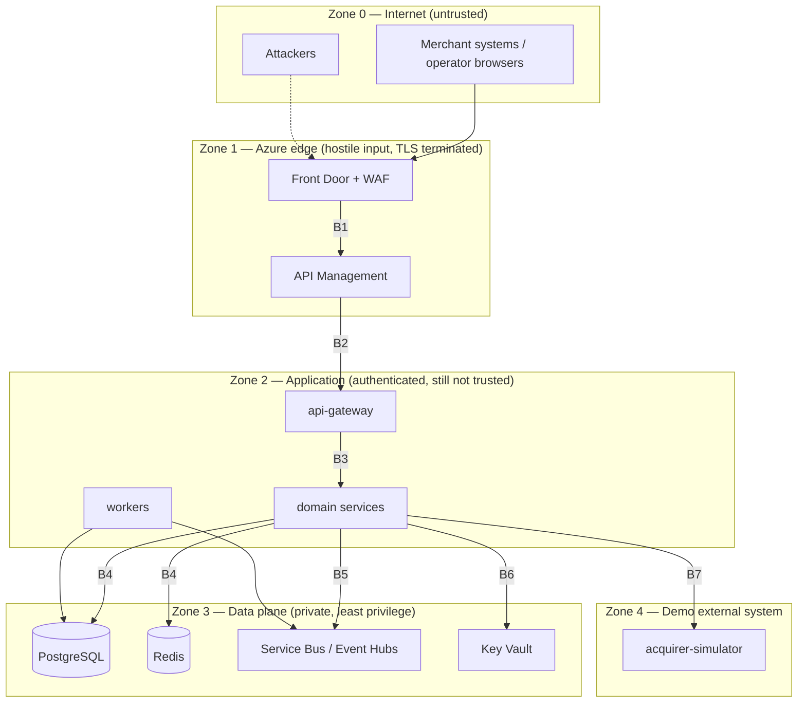

# Security Trust Boundaries

> Status: Phase 0. The full threat model lands with Phase 12; this defines where trust changes.

## 1. Boundary map

## 2. Boundary controls

| Boundary | Crossing | Controls |
| --- | --- | --- |
| B0 | Internet → Front Door | TLS 1.2+, WAF OWASP ruleset, DDoS protection, request size limits |
| B1 | Front Door → APIM | Private origin, origin verification header/private link, IP restriction |
| B2 | APIM → api-gateway | JWT validation (issuer, audience, exp, signature), rate limiting per subscription and per merchant, payload size cap, schema validation |
| B3 | gateway → service | Service identity token (short-lived), mTLS/NetworkPolicy, permission scopes, correlation ID propagation |
| B4 | service → PostgreSQL | Private endpoint, per-service database role with minimal grants, TLS required, no shared superuser |
| B5 | service → broker | Workload Identity, per-service send/receive rights on named queues/topics only |
| B6 | service → Key Vault | Workload Identity, `Key Vault Secrets User` scoped to the service's secrets, CSI driver mount |
| B7 | service → acquirer simulator | Outbound egress policy, mock tokens only, no cardholder data, failure-mode admin endpoint is internal-only |

**Traffic originating inside AKS is not trusted.** Every internal call is authenticated and
authorized; NetworkPolicies default-deny and are opened per required path.

## 3. Identity model

| Principal | Authentication | Authorization |
| --- | --- | --- |
| Human operator | Microsoft Entra ID (prod) / local identity-service (dev) | Permission-based RBAC |
| Merchant system | OAuth2 client credentials via APIM | Merchant-scoped permissions |
| Service workload | Workload Identity federated credential | Scoped Azure RBAC + service token scopes |
| CI/CD | GitHub OIDC federation | Deployment-scoped role assignments |

Authorization decisions are made on **permissions**, never on role names. Roles are a bundle of
permissions; code checks `payments.capture`, not `role === 'MERCHANT_ADMIN'`.

### Permission catalogue (initial)

`payments.read`, `payments.create`, `payments.capture`, `payments.refund`, `payments.cancel`,
`ledger.read`, `ledger.post` (service-only), `merchants.read`, `merchants.write`,
`settlements.read`, `settlements.approve`, `reconciliation.read`, `reconciliation.resolve`,
`risk.read`, `risk.override`, `admin.operations`, `admin.replay`.

### Role → permission mapping (initial)

| Role | Permissions |
| --- | --- |
| `CUSTOMER` | — (no direct platform access in scope) |
| `MERCHANT_ADMIN` | `payments.*` (own merchant), `merchants.read/write` (own), `settlements.read` (own), `ledger.read` (own) |
| `MERCHANT_OPERATOR` | `payments.read/create/capture/refund` (own merchant) |
| `FINANCE_OPERATOR` | `ledger.read`, `settlements.read`, `settlements.approve` |
| `RISK_ANALYST` | `risk.read`, `risk.override`, `payments.read` |
| `RECONCILIATION_OPERATOR` | `reconciliation.read`, `reconciliation.resolve`, `payments.read`, `ledger.read` |
| `SUPPORT` | `payments.read`, `merchants.read`, `reconciliation.read` |
| `PLATFORM_ADMIN` | `admin.operations`, `admin.replay`, all read permissions |
| `SERVICE` | Narrow, per-service scopes such as `ledger.post` |

Merchant-scoped permissions additionally require a tenancy check: the token's merchant claim must
match the resource's merchant, enforced in the service, not only at the gateway.

## 4. Data classification

| Class | Examples | Rules |
| --- | --- | --- |
| PUBLIC | API docs, health status | No restriction |
| INTERNAL | Service metrics, aggregate counts | Authenticated access |
| CONFIDENTIAL | Merchant profile, settlement totals, ledger entries | RBAC + tenancy scoping, audited reads on sensitive endpoints |
| SENSITIVE | Credentials, tokens, keys, customer PII, provider secrets | Key Vault, redaction, never logged, minimal retention |

Never stored: card PAN, CVV, full track data, raw passwords (only hashes), plaintext tokens.
The acquirer simulator operates on mock payment references/tokens only.

## 5. Logging and redaction rules

Redacted at the logger level (structure, not regex-on-message): `authorization`, `cookie`,
`password`, `token`, `refreshToken`, `apiKey`, `secret`, `cardNumber`, `cvv`, `pan`,
`customer.email`, `customer.phone`.

Audit records store `beforeState`/`afterState` of **business fields only**; they never contain
authentication material or full payment payloads.

## 6. Abuse cases considered from day one

| Abuse case | Primary mitigation |
| --- | --- |
| Payment replay | Idempotency keys with request hashing; provider idempotency by attempt ID |
| Idempotency-key squatting across tenants | Keys scoped to `(actor/merchant, key)`, never global |
| Authorization bypass by tenant swap | Tenancy check inside each service, not only at the gateway |
| Privilege escalation via role name checks | Permission-based checks only |
| Message injection | Broker access is private + identity-scoped; envelope schema validation before handling |
| Message replay | Inbox dedupe by `event_id + consumer` |
| Audit tampering | Append-only tables, no update/delete grants, separate retention |
| Secret leakage | Key Vault + CSI, secret scanning in CI, no secrets in Bicep or code |
| Supply chain | Lockfile, SBOM, container scan, CodeQL, Dependabot, non-root minimal images |
| Failure-mode abuse | Acquirer simulator controls exposed only on an internal admin route, disabled in prod |
